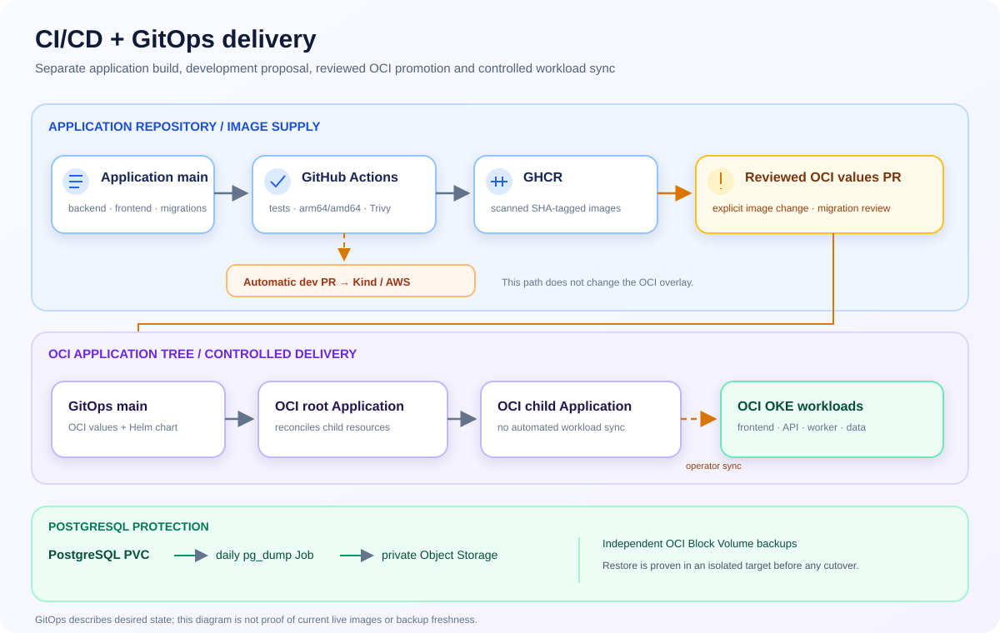

# CloudOps Insight · GitOps

[](https://github.com/ridhampansara27/cloudops-gitops/actions/workflows/gitops-validation.yml)


**The reviewed deployment contract for CloudOps Insight.** This repository owns the Helm chart, environment values, OCI Argo CD application tree, Cloudflare Tunnel connector, Sealed Secrets controller definition and PostgreSQL logical-backup workload. Application code lives in [cloudops-insight](https://github.com/ridhampansara27/cloudops-insight); OCI resources live in [cloudops-infrastructure](https://github.com/ridhampansara27/cloudops-infrastructure).

> [!IMPORTANT]
> **The commercial service runs on OCI OKE.** The active overlay is `environments/oci-dev/values.yaml`, despite its historical name. At the certified 29 September 2026 snapshot, GitOps commit `473ad08567eb32d8ca09c59fdeb7c9199c07e3ff` selected application images `sha-29d8aede6537165e8cf051641c6b6f3f79709839`. Check current OCI values and Argo CD before an operation; these are snapshot identifiers.

**Explore:** [Delivery architecture](#delivery-architecture) · [Environments](#active-versus-historical-environments) · [Versions](#repository-map-and-versions) · [Validation](#validate-a-proposed-change-windows-powershell) · [Operations](#production-change-and-rollback)

## Delivery architecture



Application CI publishes tested and scanned SHA-tagged images to GHCR. Its automatic deployment PR changes only Kind and historical AWS development overlays. OCI promotion is a separate reviewed change to this repository; the OCI root reconciles Argo CD **Application objects**, while the CloudOps child requires a controlled workload sync. [Detailed GitOps and backup flow](docs/architecture.md) and [deployment rollback](docs/runbooks/deployment-rollback.md) explain the operational sequence.

| Boundary | Owner | What happens |
|---|---|---|
| Build and scan | [Application repository](https://github.com/ridhampansara27/cloudops-insight) | Tests, Trivy scan, `linux/amd64` and `linux/arm64` image publication |
| Desired state | **This repository** | Helm templates, OCI values, Argo CD applications and logical dump CronJob |
| Cloud resources | [Infrastructure repository](https://github.com/ridhampansara27/cloudops-infrastructure) | VCN, OKE, Block Volume policy, Object Storage and recovery resources |

## Active versus historical environments

| Path | Meaning | Current use |
|---|---|---|
| `environments/oci-dev/values.yaml` | OCI OKE commercial deployment, canonical `cloudopsinsight.tech` | **Active hosting configuration** |
| `argocd/oci-root-app.yaml` and `argocd/oci-applications/` | OCI-only Argo CD application tree | **Active** |
| `environments/dev/values.yaml` | Kind development | Local/optional |
| `environments/aws-dev/values.yaml` and `argocd/applications/` | Former AWS EKS hosting plus older Argo applications | Historical/optional; not selected by OCI root |
| `environments/stage/values.yaml`, `environments/prod/values.yaml` | Placeholder overlays with `not-deployed-yet` image tags | **Not live production** |

The historical name `oci-dev` and `runtime.appEnv: staging` do not accurately describe the externally available commercial deployment. They are documented facts at this revision; correcting them requires a separately reviewed production change. AWS is still supported as a **monitored customer cloud**, not as this service's current host.

The OCI root automatically reconciles **Application resources** from `argocd/oci-applications`. The OCI CloudOps child does not declare automated sync; workload changes require a controlled sync. The application CI's automatically generated PR updates Kind and historical AWS development values, **not** OCI. Development proposals are reviewed independently of OCI promotions.

## Repository map and versions

| Path | Purpose |
|---|---|
| `charts/cloudops-insight/` | Shared Helm templates, services, app runtime, backup CronJob |
| `environments/` | Helm overlays; consult the status table above |
| `argocd/oci-applications/` | OCI application and Sealed Secrets controller |
| `argocd/applications/`, `kubernetes/aws/` | Historical EKS and local application assets |
| `.github/workflows/gitops-validation.yml` | Static YAML checks, chart lint, all-overlay render and parse |

| Component | Configured value | Source |
|---|---|---|
| Helm chart / appVersion | 0.1.0 / 0.1.0 (chart metadata, not deployed image release) | `Chart.yaml` |
| Application backend and frontend | `sha-29d8aede6537165e8cf051641c6b6f3f79709839` | OCI overlay |
| PostgreSQL / Redis | `17-alpine` / `7-alpine` | OCI overlay |
| cloudflared | `2026.9.0` | Chart defaults selected by OCI |
| Sealed Secrets Helm chart | `2.20.0` | OCI Argo CD application |
| Backup dump / uploader images | `postgres:17-alpine` / `curlimages/curl:8.21.0` | Chart defaults |

These are repository values, not verified running image digests or the installed Argo CD version. See [architecture and backup flow](docs/architecture.md).

## Validate a proposed change (Windows PowerShell)

Prerequisites: Helm 3 and Python with PyYAML, or use the GitHub Actions PR validation. From this repository's root:

```powershell
helm lint charts/cloudops-insight
helm lint charts/cloudops-insight --values environments/oci-dev/values.yaml
helm template cloudops charts/cloudops-insight --namespace cloudops --values environments/oci-dev/values.yaml | Out-Null
```

CI also lints and renders `dev`, `aws-dev`, `oci-dev`, `stage`, and `prod`, and parses the resulting YAML. A successful Helm render is not a production authorization.

## Production change and rollback

1. Verify the application image exists for `linux/arm64` and its scans and tests passed.
2. Make a focused OCI values PR, checking image tags, generated Helm diff, migrations, secrets, backup schedule, and resource limits.
3. After review and merge, compare Argo CD desired state with the live OKE state, then perform a controlled child-application sync.
4. Confirm Argo CD health, rollout, readiness, frontend/API access, and backup status.

For rollback and restore decisions, use [deployment runbook](docs/runbooks/deployment-rollback.md) and [PostgreSQL recovery runbook](docs/runbooks/postgres-recovery.md). Reverting image tags does not reverse database migrations.

Secrets are supplied outside plain Git. The backup upload PAR is stored as Sealed Secrets ciphertext bound to its Kubernetes namespace and Secret name. Never copy plaintext credentials into values, logs, issues, or PR descriptions.

See [SECURITY.md](SECURITY.md), [CONTRIBUTING.md](CONTRIBUTING.md), [CHANGELOG.md](CHANGELOG.md), and the [OCI Terraform repository](https://github.com/ridhampansara27/cloudops-infrastructure).
