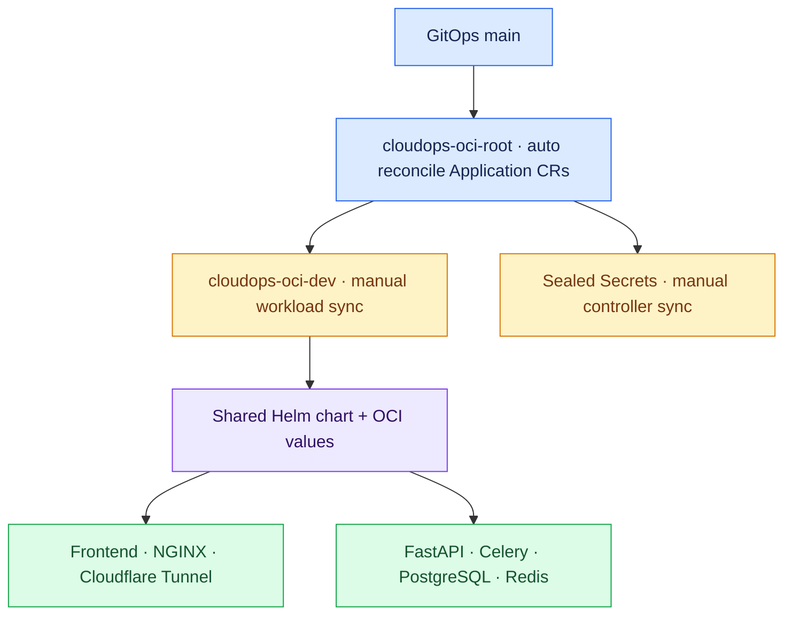
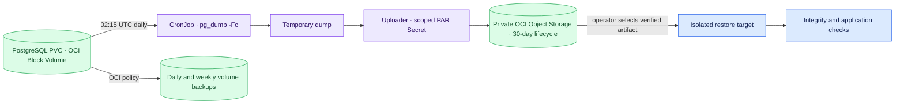

# GitOps architecture and PostgreSQL protection

## OCI application tree

The OCI root uses only `argocd/oci-applications`. The older `argocd/root-app.yaml` selects `argocd/applications` and must not be confused with the OCI root.

## PostgreSQL backup and isolated restore

The dump container gets the database password but not the OCI upload credential; the uploader gets the scoped upload credential but not the database password. They share only the temporary dump. CronJob concurrency is `Forbid`, and OCI values set `enabled: true` and `suspend: false`. The one-shot validation job remains disabled by default. Terraform independently configures volume backups, bucket retention, and recovery-key vault resources.

The logical dump is not itself proof of recoverability. A restore drill was completed for the certified launch; future operators should record the artifact, isolated target, integrity result, and date without publishing secrets. See [recovery runbook](runbooks/postgres-recovery.md).
